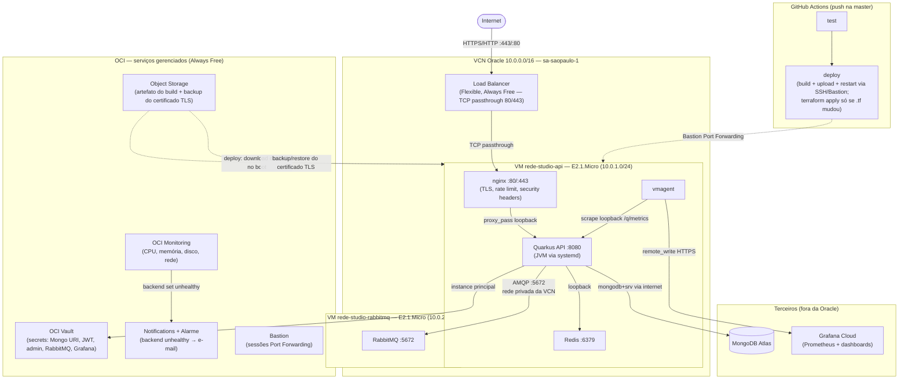

# rede-studio-api

This project uses Quarkus, the Supersonic Subatomic Java Framework.

If you want to learn more about Quarkus, please visit its website: <https://quarkus.io/>.

## Arquitetura Cloud (produção)

A API roda hoje na **Oracle Cloud Infrastructure (OCI) Always Free**, com
banco de dados na **MongoDB Atlas** e observabilidade na **Grafana Cloud**.
Todos os componentes de produção têm custo zero.

### Transição AWS → Oracle Cloud

A arquitetura original de bootstrap (menor custo possível) rodava na AWS —
EC2 + Elastic IP + S3 + Secrets Manager. Ela foi reproduzida na Oracle Cloud
por custo/benefício: a Oracle oferece um tier Always Free mais generoso
(compute, secrets, object storage, e-mail e monitoramento sem cobrança
recorrente), permitindo desligar os recursos pagos da AWS sem perder
capacidade. A infraestrutura AWS que gerava custo (EC2, Elastic IP, S3,
Secrets Manager, ECR) foi desmontada depois da migração validada; a rede e
os papéis IAM originais foram mantidos (não geram custo, preservados para
referência/possível reuso futuro).

### Diagrama — componentes por local de execução



### CI/CD

Push (via merge de PR) na `master` dispara `.github/workflows/ci.yml`: o job
`test` roda a suíte (Mongo/Redis/RabbitMQ como `services:` containers), e o
job `deploy` builda o JAR, sobe pro Object Storage e reinicia o serviço
`rede-studio` via SSH (sessão Bastion Port Forwarding, chave dedicada à CI)
— **sem recriar a VM**. `terraform apply` só roda quando o push realmente
altera algo em `oracle-deployment/terraform/` (detectado via `git diff`), e
sem `-replace` forçado — o próprio Terraform decide se precisa recriar a
instância. Essa separação existe porque recriar a VM em todo deploy também
forçava o Certbot a reemitir o certificado TLS a cada vez, e o Let's
Encrypt só permite 5 emissões por domínio a cada 168h (ver `CLAUDE.md`,
seção Deployment, para o incidente real e o fix de persistência do
certificado).

### Componentes

| Onde roda | Componente | Função |
|---|---|---|
| VCN | Load Balancer | IP público estável (Flexible, Always Free), TCP passthrough 80/443, health check do backend |
| VM `rede-studio-api` | nginx | TLS (Certbot), rate limiting, headers de segurança, reverse proxy pra Quarkus |
| VM `rede-studio-api` | Quarkus (JVM) | A API em si, `systemd`, heap limitado (`-Xmx350m`) |
| VM `rede-studio-api` | Redis | Idempotência de mensagens e sessão/auth (`IdempotencyService`, `AuthService`) |
| VM `rede-studio-api` | vmagent | Coleta `/q/metrics` e envia pra Grafana Cloud |
| VM `rede-studio-rabbitmq` | RabbitMQ | Fila de mensageria (consumer de registro de usuário) |
| OCI (gerenciado) | Vault | Todos os secrets da aplicação |
| OCI (gerenciado) | Object Storage | Artefato do build (`quarkus-app.tar.gz`) + backup do certificado TLS |
| OCI (gerenciado) | Monitoring + Notifications | Métricas de infraestrutura + alarme de backend unhealthy por e-mail |
| OCI (gerenciado) | Bastion | Acesso SSH via sessões Port Forwarding (Managed SSH não funciona nesta shape) |
| MongoDB Atlas | — | Banco de dados (mesmo cluster usado no período AWS) |
| Grafana Cloud | — | Métricas de aplicação e dashboards de produção |
| GitHub Actions | — | CI/CD: testes + deploy automático no push na `master` |

Detalhes de infraestrutura, decisões e problemas reais encontrados no
caminho (rede, IAM, bugs de imagem Ubuntu, etc.) ficam em
`oracle-deployment/` e no histórico de planejamento em `.claude/` (não
versionado — uso local de desenvolvimento).

## Running the application in dev mode

You can run your application in dev mode that enables live coding using:

```shell script
./mvnw quarkus:dev
```

> **_NOTE:_**  Quarkus now ships with a Dev UI, which is available in dev mode only at <http://localhost:8080/q/dev/>.

## Packaging and running the application

The application can be packaged using:

```shell script
./mvnw package
```

It produces the `quarkus-run.jar` file in the `target/quarkus-app/` directory.
Be aware that it’s not an _über-jar_ as the dependencies are copied into the `target/quarkus-app/lib/` directory.

The application is now runnable using `java -jar target/quarkus-app/quarkus-run.jar`.

If you want to build an _über-jar_, execute the following command:

```shell script
./mvnw package -Dquarkus.package.jar.type=uber-jar
```

The application, packaged as an _über-jar_, is now runnable using `java -jar target/*-runner.jar`.

## Creating a native executable

You can create a native executable using:

```shell script
./mvnw package -Dnative
```

Or, if you don't have GraalVM installed, you can run the native executable build in a container using:

```shell script
./mvnw package -Dnative -Dquarkus.native.container-build=true
```

You can then execute your native executable with: `./target/rede-studio-api-1.0.0-SNAPSHOT-runner`

If you want to learn more about building native executables, please consult <https://quarkus.io/guides/maven-tooling>.

## Related Guides

- SmallRye Health ([guide](https://quarkus.io/guides/smallrye-health)): Monitor service health
- SmallRye JWT Build ([guide](https://quarkus.io/guides/security-jwt-build)): Create JSON Web Token with SmallRye JWT Build API
- Hibernate Validator ([guide](https://quarkus.io/guides/validation)): Bean validation using Hibernate Validator and Jakarta Validation annotations
- SmallRye JWT ([guide](https://quarkus.io/guides/security-jwt)): Secure your applications with JSON Web Token
- MongoDB with Panache ([guide](https://quarkus.io/guides/mongodb-panache)): Simplify your persistence code for MongoDB via the active record or the repository pattern
- REST Jackson ([guide](https://quarkus.io/guides/rest#json-serialisation)): Jackson serialization support for Quarkus REST. This extension is not compatible with the quarkus-resteasy extension, or any of the extensions that depend on it
- YAML Configuration ([guide](https://quarkus.io/guides/config-yaml)): Use YAML to configure your Quarkus application
- Micrometer Registry Prometheus ([guide](https://quarkus.io/guides/micrometer)): Enable Prometheus support for Micrometer
