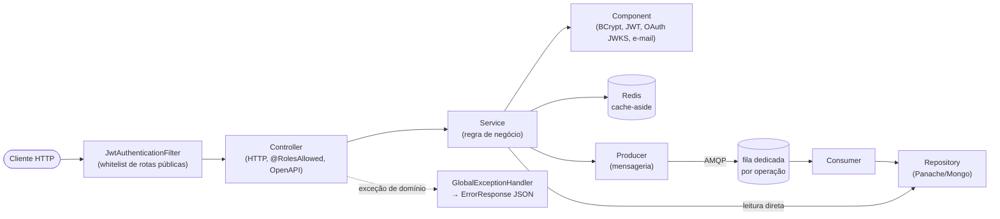
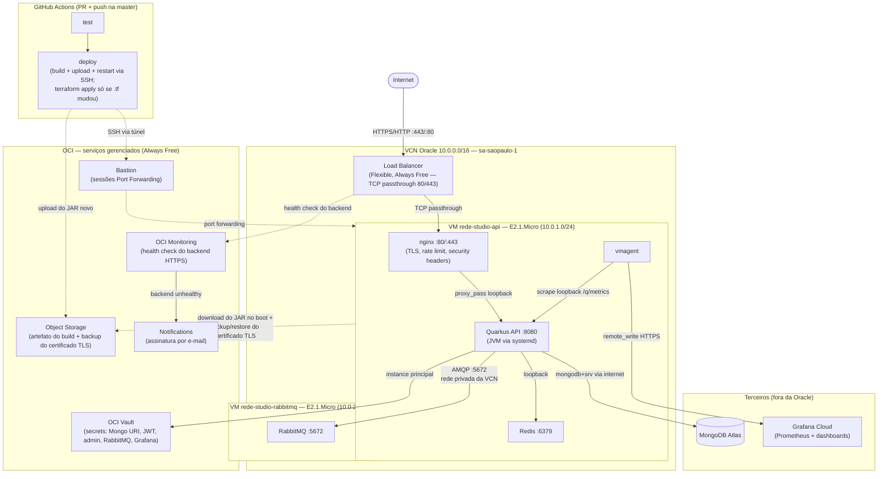

# rede-studio-api

API REST (Quarkus, Java 21) para o **Rede Studio** — a ferramenta de desenho e
documentação de infraestrutura de rede corporativa. Este repositório é o
backend; o frontend (React/TypeScript) vive em `rede-sp-cwb`.

## Objetivo

Dar ao Rede Studio (frontend) um backend real de autenticação e persistência
multi-usuário/multi-projeto: cada usuário autenticado tem N projetos, cada
projeto guarda o estado completo de uma topologia de rede desenhada no
Studio (sites, tiers, nós, ACLs, VLANs, rotas, Tech Profiles), salvo e
recuperado entre sessões e dispositivos — sem isso, o Studio seria só
`localStorage` local ao navegador, sem login nem multi-dispositivo.

## Descrição da API

- **Autenticação**: registro/login por senha (BCrypt + JWT assinado RSA) e
  login social (Google/Microsoft — o frontend obtém o ID token do provedor,
  esta API só verifica a assinatura via JWKS do provedor, nunca fala com o
  endpoint de token dele).
- **Gestão de usuários**: perfil self-service (`/api/users/me`) e
  administração de usuários restrita a `ADMIN`.
- **Projetos**: CRUD de projetos por usuário (`/api/projects`), cada um
  guardando um snapshot completo do estado de rede desenhado no Studio.
- Endpoints de saúde/observabilidade do próprio Quarkus:
  `/q/health/live`, `/q/health/ready`, `/q/metrics`.

## Arquitetura da API

### Diagrama de camadas



Toda requisição passa pelo `JwtAuthenticationFilter` antes de qualquer
outra coisa: libera os endpoints públicos (`/api/auth/*`, `/q/health`,
`/q/metrics`, `/q/openapi`, `/q/swagger-ui`) e exige um `Authorization:
Bearer` bem-formado pra qualquer outra rota — sem validar o token em si,
isso fica por conta do SmallRye JWT (`@RolesAllowed`/`@Authenticated`) no
endpoint. Nenhuma exceção de domínio (`UserAlreadyExistsException`,
`InvalidCredentialsException`, `NotFoundException`, etc.) escapa como
stack trace: um único `GlobalExceptionHandler` converte tudo num
`ErrorResponse` JSON padronizado.

### Pacotes e papel de cada camada

| Pacote | Papel | Exemplos reais no código |
|---|---|---|
| `controllers` | Só concerns de HTTP: rota, status code, `@RolesAllowed`, anotações OpenAPI. Nenhuma regra de negócio. | `AuthController`, `UserController`, `MeController`, `ProjectController` |
| `services` | Toda a regra de negócio; orquestram repositories, components e producers. | `AuthService`, `UserService`, `ProjectService`, `ProjectCacheService`, `IdempotencyService` |
| `repositories` | Acesso a dado — MongoDB via Panache. | `UserRepository`, `ProjectRepository`, `NetworkStateRepository` |
| `components` | Integrações pontuais que não são nem service nem repository. | `PasswordHasher` (BCrypt), `JwtTokenBuilder` (RSA), `OAuthTokenVerifier` (JWKS Google/Microsoft), `RegistrationMailer` |
| `entities` | Documentos do MongoDB (Panache). | `UserEntity`, `ProjectEntity`, `NetworkStateEntity` |
| `dtos/request`, `dtos/response` | Contrato HTTP de entrada/saída — nunca expõem `entities` direto. | `RegisterRequest`, `LoginRequest`, `SaveSnapshotRequest`, `AuthResponse` |
| `messaging` | Producers/consumers RabbitMQ — braço assíncrono do padrão de escrita (abaixo). | `UserRegistrationProducer`/`Consumer`, `ProjectMutationProducer`/`Consumer` |
| `filters` | Autenticação de borda, antes do JAX-RS. | `JwtAuthenticationFilter` |
| `handlers` | Tradução de exceção → resposta HTTP. | `GlobalExceptionHandler`, `ConstraintViolationExceptionMapper` |
| `configurations` | Beans de configuração. | `JwtConfiguration`, `OAuthConfiguration`, `CorsConfiguration`, `OpenApiConfiguration`, `AdminConfiguration` |
| `runners` | Código de startup. | `StartupRunner` (cria o usuário admin na primeira subida, se não existir) |

### Endpoints

| Método | Rota | Acesso | Controller |
|---|---|---|---|
| `POST` | `/api/auth/register` | público | `AuthController` |
| `POST` | `/api/auth/login` | público | `AuthController` |
| `POST` | `/api/auth/oauth/{provider}` | público | `AuthController` |
| `GET`/`PATCH` | `/api/users/me` | `USER`, `ADMIN` | `MeController` |
| `GET` | `/api/users` | `ADMIN` | `UserController` |
| `POST` | `/api/users/search/{email\|username\|name}` | `ADMIN` | `UserController` |
| `PATCH` | `/api/users/email/{email}` | `ADMIN` | `UserController` |
| `PATCH` | `/api/users/email/{email}/password` | `ADMIN` | `UserController` |
| `DELETE` | `/api/users/email/{email}` | `ADMIN` | `UserController` |
| `POST`/`GET` | `/api/projects` | `USER`, `ADMIN` | `ProjectController` |
| `GET`/`PATCH`/`DELETE` | `/api/projects/{id}` | `USER`, `ADMIN` | `ProjectController` |
| `PUT` | `/api/projects/{id}/snapshot` | `USER`, `ADMIN` | `ProjectController` |

### Modelo de autenticação

Senhas com BCrypt; JWT assinado RSA carregando `sub`/`upn` (email), `uid`
(o `_id` do Mongo, resolvido via `jwt.getClaim("uid")` — não
`getSubject()` — pra qualquer relação por dono de entidade) e `groups`
(roles, usadas direto em `@RolesAllowed`). Login e registro devolvem o
mesmo erro genérico pra "usuário não existe" e "senha errada", de
propósito, pra não permitir enumeração de usuários.

### Padrão de escrita/leitura (mensageria)

Toda escrita de entidade de domínio passa por **Redis → fila (RabbitMQ) →
MongoDB**, nunca um `save()` síncrono direto no Mongo a partir da thread
da requisição:
1. O `Service` grava o novo estado no Redis (é isso que torna uma leitura
   logo depois da escrita consistente) e publica numa fila **dedicada por
   operação**, via um `Producer` (`UserRegistrationProducer` → fila
   `user.registration`; `ProjectMutationProducer` → filas
   `project.create`/`project.rename`/`project.snapshot`/`project.delete`
   — uma fila por operação, não uma fila compartilhada com
   discriminador), respondendo ao cliente imediatamente, sem esperar o
   `Consumer` persistir no Mongo.
2. O `Consumer` correspondente (`UserRegistrationConsumer`,
   `ProjectMutationConsumer`) lê da fila e grava de fato no Mongo via o
   `Repository`.
3. A leitura consulta o Redis primeiro (cache-aside, TTL ~24h); em caso de
   miss, cai pro Mongo e repopula o Redis.

## Portas utilizadas

| Porta | Serviço | Onde |
|---|---|---|
| `8080` | API Quarkus | Local (direto) e produção (interna, via `systemd`, nunca exposta direto) |
| `8090` → `80` | nginx (proxy local) | Só local (Docker Compose) |
| `80`/`443` | nginx (TLS, rate limit) | Produção, atrás do Load Balancer |
| `27018` → `27017` | MongoDB | Só local (Docker Compose — `27017` costuma estar ocupado pelo Mongo do SO) |
| `5672` | RabbitMQ (AMQP) | Local e produção (produção: só dentro da VCN) |
| `15672` | RabbitMQ Management UI | Só local |
| `6379` | Redis | Local e produção (produção: loopback da VM da API) |
| `9090` | Prometheus | Só local |
| `3000` | Grafana | Só local (`admin`/`admin` em dev) |

Em produção, MongoDB é Atlas (fora da rede da OCI) e métricas vão pro
Grafana Cloud via `vmagent` — nenhuma dessas duas portas locais (Prometheus,
Grafana próprios) existe lá.

## Rodando localmente

### Pré-requisitos

Chaves JWT (uma vez só, saída em `secrets/`, gitignored):

```bash
bash generate-jwt-keys.sh
```

### Opção 1 — dev mode (live reload)

```bash
./mvnw quarkus:dev
```

MongoDB sobe sozinho via Quarkus Dev Services (precisa de Docker rodando).
Redis e RabbitMQ **não** ativam Dev Services aqui (`application.yml` já dá
um host default explícito pros dois, então o Dev Services não os trata
como "não configurados") — suba-os à parte:

```bash
docker run -d --rm -p 6379:6379 redis:7-alpine
docker run -d --rm -p 5672:5672 rabbitmq:3.13-management-alpine
```

Dev UI em <http://localhost:8080/q/dev/>.

### Opção 2 — stack completa (Docker Compose)

Sobe API + MongoDB + Redis + RabbitMQ + nginx + Prometheus + Grafana, tudo
junto:

```bash
cd docker/dev
docker compose up --build
```

Requer `.env.dev` (já no repo) e as chaves de `secrets/` do passo anterior.

### Rodando os testes

```bash
./mvnw test                                    # suíte completa
./mvnw test -Dtest=AuthControllerTest          # uma classe
./mvnw test -Dtest=AuthControllerTest#loginReturnsToken  # um método
```

Mesmo requisito de Redis/RabbitMQ da Opção 1 acima.

## Arquitetura Cloud (produção)

A API roda hoje na **Oracle Cloud Infrastructure (OCI) Always Free**, com
banco de dados na **MongoDB Atlas** e observabilidade na **Grafana Cloud**.
Todos os componentes de produção têm custo zero.

### Transição AWS → Oracle Cloud

A arquitetura original de bootstrap (menor custo possível) rodava na AWS —
EC2 + Elastic IP + S3 + Secrets Manager. Ela foi reproduzida na Oracle Cloud
por custo/benefício: a Oracle oferece um tier Always Free mais generoso
(compute, secrets, object storage, e-mail e monitoramento sem cobrança
recorrente), permitindo desligar os recursos pagos da AWS sem perder
capacidade. A infraestrutura AWS que gerava custo (EC2, Elastic IP, S3,
Secrets Manager, ECR) foi desmontada depois da migração validada; a rede e
os papéis IAM originais foram mantidos (não geram custo, preservados para
referência/possível reuso futuro).

### Diagrama — componentes por local de execução



O `Deploy` conecta na VM sempre por um túnel de Bastion Port Forwarding — nunca
SSH direto (porta 22 não é pública). Todas as setas pontilhadas (`-.->`)
representam quem **inicia** a chamada de rede (ex.: é a VM que busca o JAR no
Object Storage no boot, não o contrário).

### CI/CD

Push (via merge de PR) na `master` dispara `.github/workflows/ci.yml`: o job
`test` roda a suíte (Mongo/Redis/RabbitMQ como `services:` containers), e o
job `deploy` builda o JAR, sobe pro Object Storage e reinicia o serviço
`rede-studio` via SSH (sessão Bastion Port Forwarding, chave dedicada à CI)
— **sem recriar a VM**. `terraform apply` só roda quando o push realmente
altera algo em `oracle-deployment/terraform/` (detectado via `git diff`), e
sem `-replace` forçado — o próprio Terraform decide se precisa recriar a
instância. Essa separação existe porque recriar a VM em todo deploy também
forçava o Certbot a reemitir o certificado TLS a cada vez, e o Let's
Encrypt só permite 5 emissões por domínio a cada 168h (ver `CLAUDE.md`,
seção Deployment, para o incidente real e o fix de persistência do
certificado).

### Componentes

| Onde roda | Componente | Função |
|---|---|---|
| VCN | Load Balancer | IP público estável (Flexible, Always Free), TCP passthrough 80/443, health check do backend |
| VM `rede-studio-api` | nginx | TLS (Certbot), rate limiting, headers de segurança, reverse proxy pra Quarkus |
| VM `rede-studio-api` | Quarkus (JVM) | A API em si, `systemd`, heap limitado (`-Xmx350m`) |
| VM `rede-studio-api` | Redis | Idempotência de mensagens e sessão/auth (`IdempotencyService`, `AuthService`) |
| VM `rede-studio-api` | vmagent | Coleta `/q/metrics` e envia pra Grafana Cloud |
| VM `rede-studio-rabbitmq` | RabbitMQ | Fila do padrão de escrita LB → Redis → fila → Mongo (registro de usuário, criar/renomear/excluir/snapshot de projeto — uma fila dedicada por operação) |
| OCI (gerenciado) | Vault | Todos os secrets da aplicação |
| OCI (gerenciado) | Object Storage | Artefato do build (`quarkus-app.tar.gz`) + backup do certificado TLS |
| OCI (gerenciado) | Monitoring | Health check do backend HTTPS do Load Balancer |
| OCI (gerenciado) | Notifications | Assinatura por e-mail, dispara quando o Monitoring acima acusa backend unhealthy |
| OCI (gerenciado) | Bastion | Túnel SSH via sessões Port Forwarding — usado pelo `deploy` da CI e por debug manual (Managed SSH não funciona nesta shape) |
| MongoDB Atlas | — | Banco de dados (mesmo cluster usado no período AWS) |
| Grafana Cloud | — | Métricas de aplicação e dashboards de produção |
| GitHub Actions | — | CI/CD: `test` em PR e push, `deploy` automático só no push na `master` |

Detalhes de infraestrutura, decisões e problemas reais encontrados no
caminho (rede, IAM, bugs de imagem Ubuntu, etc.) ficam em
`oracle-deployment/` e no histórico de planejamento em `.claude/` (não
versionado — uso local de desenvolvimento).

## Deploy em produção

### Fluxo automático (recomendado)

1. Abra um PR pra `master` — dispara o job `test`.
2. Faça o merge — dispara `test` de novo e então `deploy`, que builda o
   JAR, sobe pro Object Storage e reinicia o serviço via SSH sozinho.
3. Se o PR também mudou algo em `oracle-deployment/terraform/`, o
   `deploy` roda `terraform apply` antes de tudo (só nesse caso).

Nenhum passo manual — é só mergear.

### Fluxo manual (fallback local)

Precisa de `~/.oci/config` configurado e uma chave SSH autorizada na VM
(`ops_ssh_public_key`, ver `oracle-deployment/terraform/variables.tf`):

```bash
bash oracle-deployment/deploy-oracle.sh
```

Mesma lógica do `deploy` da CI: builda, sobe o JAR e reinicia o serviço via
SSH — **nunca** recria a VM sozinho.

### Mudança de infraestrutura (`.tf`)

Fora do fluxo de deploy de código. Rode local, com sua própria credencial
OCI (mais ampla que a da CI, de propósito):

```bash
cd oracle-deployment/terraform
terraform plan     # confira o diff antes
terraform apply
```
